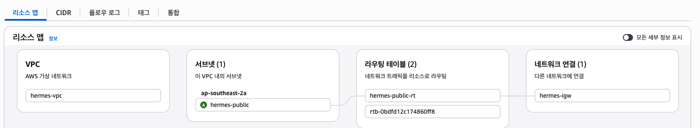
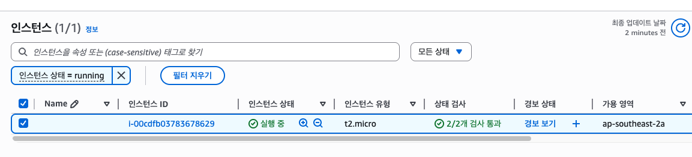
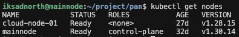
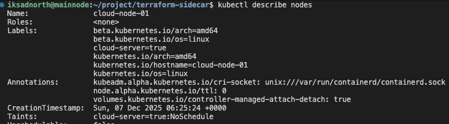

# Hermes

헤르메스는 길 잃은 나그네들의 수호신입니다. 


*그림 0: 길 잃은 양들을 인도하는 헤르메스 그림*

본 프로젝트는 과도한 트래픽으로 인해 IP 차단이 발생한 크롤링 노드들을 새로운 AWS 클라우드 환경으로 자동 이전하여, 서비스 중단 없이 크롤링 작업을 지속할 수 있도록 설계했습니다.

온프레미스 환경에 구축된 Kubernetes Control Plane과 AWS 상의 EC2 노드를 연동하여 하이브리드 Kubernetes 클러스터를 구성했습니다.

Terraform을 활용해 AWS EC2 인스턴스를 자동으로 프로비저닝하고, 생성된 노드가 Kubernetes 클러스터에 자동으로 조인되도록 구성했습니다.

이를 통해 IP 차단이 발생한 크롤링 컨테이너들은 별도의 수작업 없이 새로운 클라우드 노드로 자동 마이그레이션합니다.

인프라 구성, 노드 확장, 클러스터 조인까지의 전 과정은 Terraform 기반 IaC(Infrastructure as Code)로 자동화되어, 운영 개입을 최소화하고 재현성과 안정성을 확보했습니다.


## 왜 이런 식으로 만들었나요?

- **온프레미스 서버만 사용하면 IP 차단 시 대체할 서버가 없다..**
  - AWS 클라우드와 온프레미스를 연결하는 하이브리드 클러스터를 구성해보자!
- **AWS 클라우드 서버를 새로 띄우려면 꼭 내가 직접 AWS 콘솔창에 입력해야 하나? 자동화할 수는 없는건가..**
  - Terraform으로 AWS 클라우드 노드 자동 생성 및 Kubernetes 클러스터 자동 조인을 구현해보자!
- **Docker Compose로 1개 이상의 서버들의 컨테이너를 통합관리하는 것이 너무 힘들다..**
  - K8s를 도입해서 다중 노드의 컨테이너를 하나의 서버에서 제어해보자!
- **크롤링 컨테이너 말고도 DB서버 컨테이너, Airflow 컨테이너도 띄워야 하는데 이것들은 홈서버에서만 띄우고 싶다..**
  - 클라우드 노드에만 특정 라벨, Taint를 부여해서 해당 노드에는 크롤링 Pod만 띄우자!

## 이거 어떻게 작동하는 거에요?

### 과정 1: Terraform Apply에 의해 인스턴스 생성




### 과정 3: 홈서버의 K8s API Server로 노드 Join 요청



### 과정 4: 홈서버의 K8s API Server로 노드 라벨링



## 그래서 의도한 대로 성과가 나왔나요?

1. **노드 추가 작업 자동화**
    - SSH 접속, 패키지 설치, 클러스터 조인 등 모든 과정이 자동화됨

2. **인프라 관리의 일관성 확보**
    - Terraform을 통한 Infrastructure as Code로 모든 노드가 동일한 설정으로 구성됨
    - 버전 관리 및 재현 가능한 인프라 구성

3. **보안성과 크롤링 연속성 동시 확보**
    - 노드 라벨링을 통해 보안상 내부망에 존재해야 하는 pod들은 온프레미스 서버에서 띄움
    - 크롤링 노드의 연속성 확보를 위해 크롤링 pod들은 클라우드 서버에 위치시킴

## 프로젝트 구조

```
hermes/
├── versions.tf               # Terraform 버전 제약
├── providers.tf              # Terraform 프로바이더 설정
├── main-vpc.tf               # VPC, 서브넷, 라우팅 테이블 구성
├── main-node.tf              # EC2 인스턴스, 보안 그룹, SSH 키 생성
├── main-k8sjoin.tf           # Kubernetes 클러스터 조인 리소스
├── main-label.tf             # 노드 라벨 추가 리소스
├── outputs.tf                # Terraform 출력값 정의
├── variables.tf              # Terraform 변수 정의
├── terraform.tfvars.example  # 변수 설정 예시 파일
├── terraform.tfvars          # 변수 설정 파일
└── scripts/
    ├── setup-controlplane.sh # Control Plane 초기화 스크립트
    ├── init-node.sh          # 노드 초기 설정 스크립트
    ├── get-join-command.sh   # k8s join command 조회 스크립트
    └── join-cluster.sh       # 클러스터 조인 스크립트
```
